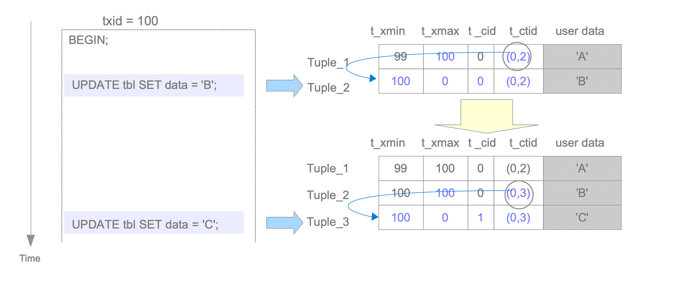

# Concurrency Control
Concurrency Control은 ACID에 해당하는 **Atomicity**, **Isolation** 을 관리하는 메커니즘  

Concurrency Control를 구현하는 방식은 크게 다음과 같다  

- Multi-version Concurrency Control (MVCC)
- Strict Two-Phase Locking (S2PL)
- Optimistic Concurrency Control (OCC)

# MVCC(Multi-version Concurrency Control)

- 각각의 쓰기(write) 연산에 대해, 이전 버전의 데이터를 유지하면서 신규 버전의 데이터를 만든다  
- 트랜잭션의 데이터 조회 시, 각 트랜잭션의 격리보장을 위해 시스템 차원에서 데이터 버전 중 하나를 선택  
- reader(데이터 조회 트랜잭션)와 writer(데이터 쓰기 트랜잭션)가 서로 블로킹(Block)하지 않는다  
    (S2PL 같은 시스템은 writer가 데이터 쓸 때, 배타 락을 얻기 위해 reader를 전부 블로킹)  
- PostgreSQL를 포함한 일부 RDBMS들은 **Snapshot Isolation(SI)** 라는 MVCC의 변형을 사용  

### Snapshot Isolation(SI)
- Oracle의 경우, 롤백 세그먼트를 통해 SI를 구현;  
    기존 버전 아이템이 롤백 세그먼트에 write 후, 신규 버전 아이템이 data area에 write  

- PostgreSQL의 경우, **visibility check rules**를 적용하는 것을 통해 SI를 구현;  
    신규 데이터는 그냥 직접적으로 관련 테이블의 페이지에 저장된다  
    데이터 아이템 조회 시, 각각 트랜잭션에 대해 적합한 버전의 아이템을 조회  

- SI는 ANSI SQL-92 표준 3가지 이상 동작 (Dirty Reads, Non-Repeatable Reads, Phantom Reads)를 허용하지 않으나, serialization 이상동작(Write Skew, Read-Only Transaction Skew)을 허용하기 때문에 진정한 의미의 Serializability를 실현하진 않는다  

- 이런 이슈를 대처하기 위해, 9.1 버전부터 Serializable Snapshot Isolation(SSI)가 추가되었다  

    **Serializable Snapshot Isolation(SSI)**  
    - serialization 이상동작을 감지
    - 이상동작으로 야기된 충돌을 해결
    - 9.1버전부터 SSI가 제공되었기 때문에, 9.1버전부터 true serializable isolation level을 제공
    - SQL Server도 SSI 사용 (Oracle은 여전히 SI만 사용)

# Transaction ID
  
[image reference](https://www.interdb.jp/pg/pgsql05/01.html)  

- Transaction Manager가 할당하는 유니크 식별자로, 트랜잭션이 시작할때 발급  
- PostgreSQL의 txid는 32비트 unsigned integer (약 42억)  
- txid_current() 함수로 현재 txid 조회 가능  
    - 0: 유효하지 않은 txid  
    - 1: Bootstrap txid; 데이터베이스 클러스터 초기화에 사용  
    - 2: **Frozen txid**  
- 현재 할당받을 txid 기준으로 더 높은 숫자의 txid는 미래에 할당될 txid이며, 현재 txid 입장에서는 아직 invisible한 txid 들이다  
- BEGIN 커맨드에는 txid가 할당 되지 않는다; BEGIN 커맨드 실행 후 최초 커맨드가 실행 될 때 txid 할당 되고, 트랜잭션 시작함  

### Frozen txid
- **Transaction wraparound problem**(과거 트랜잭션 데이터 invisible problem)을 해결하기 위해 postgreSQL이 예약한 transaction id  
- **freeze process**에 사용됨  
- 그 어떤 txid보다 항상 과거 트랜잭션이라고 설정됨  
- 항상 inactive이며 항상 visible한 트랜잭션임을 나타냄  

**Transaction wraparound problem?**  
  
[image reference](https://www.interdb.jp/pg/pgsql05/10.html)  
(2^31 + 101 txid 입장에서 보았을때, 100 txid가 미래 txid라고 인식되어서 이미 100 txid를 통해 저장한 데이터가 invisible한 상황에 대한 예시)  

loop되는 txid 할당 구조에서, 과거 txid에서 저장한 데이터가 현재 할당된 txid 기준에서 미래 txid라고 인식되어 visible하지 않게 되는 현상  

### freeze process  
- 현재 txid 기준으로 특정 임계치(= `현재 txid` - `vacuum_freeze_min_age`)보다 오래된 txid를 frozen id(2)로 바꾸는 프로세스  
- vacuum process가 freeze process를 호출함  
- **9.4 버전 이후는 txid를 frozen_txid로 바꾸지 않고, t_infomask라는 플래그를 사용**

  
[image reference](https://www.interdb.jp/pg/pgsql05/10.html)  

# Tuple Structure
테이블 정보를 담는 Heap 파일 및 페이지에 저장되는 Tuple은 크게 2가지로 나뉜다
- Data Tuple  
    HeapTypleHeaderData 구조체, NULL bitmap, user data로 구성된 페이지에 저장되는 튜플  
      
    [image_reference](https://www.interdb.jp/pg/pgsql05/02.html)  

    - t_xmin: 해당 튜플을 삽입했던 트랜잭션의 txid를 저장  
    - t_xmax: 해당 튜플을 삭제, 갱신한 트랜잭션의 txid를 저장; 만약 삭제, 갱신한 적이 없으면 0(INVALID txid)를 설정  
    - t_cid: 현재 트랜잭션의 커맨드 실행 전까지 진행된 누적 커맨드 실행 개수
    - t_ctid  
        - 최신버전 또는 현재 튜플의 식별자 id  
        - 만약 현재 튜플이 업데이트 되면, 현재 튜플이 가리키는 t_ctid 값은 최신버전의 튜플의 id로 설정됨  
        - 만약 현재 튜플이 최신버전 튜플이라면, 현재 튜플의 t_ctid로 설정  
        - (page번호, Line Pointer) 쌍으로 이루어져 있음

- TOAST Tuple  
    **TOAST?**
    - PostgreSQL에서 대용량 필드 데이터를 효율적으로 저장하기 위한 기술  
    - 한 페이지의 용량보다 큰 튜플을 저장할 수 없기 때문에, 페이지 용량 임계점(TOAST_TUPLE_THRESHOLD; default 2kb)을 초과하면 튜플 압축을 시도  
    - 만약 압축해도 임계점을 초과하면, 물리적으로 여러 row로 분할 및 기존 테이블 대신 TOAST 테이블로 분할하여 저장  
    - 기존 테이블에는 TOAST 테이블에 저장된 분할 로우들을 가리키는 포인터를 저장

# INSERT, DELETE, UPDATE Tuples
### Insertion
새로운 튜플을 삽입하면 신규 튜플의 각 튜플 헤더 데이터는 다음과 같이 설정된다  
- t_xmin: 현재 튜플 삽입을 진행하는 트랜잭션의 id
- t_xmax: 최초 삽입이므로 이전에 갱신, 삭제한 트랜잭션 id는 0(invalid)
- t_cid: 최초 삽입이므로 이전에 실행된 쿼리 커맨드는 0개
- t_ctid: (최초 삽입 튜플의 페이지 번호, 최초 삽입 튜플의 line pointer)

### Deletion
기존 튜플을 삭제하면 기존 튜플의 튜플 헤더 데이터는 다음과 같이 설정된다
- t_xmax: 삭제를 진행한 트랜잭션의 id로 업데이트  

삭제를 진행하는 트랜잭션이 commit 된 후, 필요없게 된 해당 튜플은 **Dead Tuple**로 간주된다  
**Auto Vacuum**에 의해서 Dead Tuple은 주기적으로 정리된다  

### Update  
업데이트는 최신 버전의 튜플 데이터가 페이지에 추가되고, 기존 버전의 튜플이 논리적 제거(데드 튜플로써 추후 Vacuum 대상)가 이루어진다  

- 기존 튜플
    - t_xmax: 신규 튜플의 txid
    - t_ctid: (신규 튜플의 page 번호, 신규 튜플의 line pointer)
- 신규 튜플
    - t_xmin: 해당 튜플의 txid
    - t_xmax: 0
    - t_cid: (업데이트가 일어난 현재 트랜잭션에서 이전에 실행된 쿼리 개수)
    - t_ctid: (해당 튜플의 page 번호, 해당 튜플의 line pointer)

  
[image reference](https://www.interdb.jp/pg/pgsql05/03.html)  
txid=99 트랜잭션에서 삽입된 어떤 레코드가 txid=100 트랜잭션을 거치면서 업데이트 되는 과정 예시;  
txid=100 트랜잭션 내부에는 업데이트 쿼리가 총 2개 있다  
이 예시의 트랜잭션에 따라 추가된 힙 튜플들이 저장된 페이지의 번호는 0번이며, Line Pointer는 1번부터 시작하는 것을 가정한다  

txid=100 트랜잭션 commit 후,
Tuple_1과 Tuple_2는 논리적으로 제거된 상태(Dead Tuple)가 되어, Vacuum 대상이 된다

# Commit Log (CLOG)
- 진행 중인 트랜잭션들의 상태를 보관하는 로그
- 8kb 페이지 단위로 shared memory에 저장
- 트랜잭션 처리 전반에 걸쳐 사용
- 배열로 구성되어 있고, 배열의 각 인덱스는 txid를 차용한다
- PostgreSQL가 셧다운 되거나 체크포인트 프로세스가 수행될 때 clog가 `pg_xact` 서브 디렉토리에 저장됨
- 각 파일은 0000부터 시작하는 파일이름으로 최대 256kb 바이트 저장하며, 256kb 초과시 순차적으로 숫자를 증가시킨다(0000, 0001, ...)
- clog의 크기는 페이지를 append하며 점진적으로 증가한다; 이는 Vacuum processing을 통해 주기적으로 clog 페이지와 파일을 삭제하며 정리할 수 있다

### Transaction Status
- IN_PROGRESS
- COMMITTED
- ABORTED
- SUB_COMMITTED (서브 트랜잭션에 관한 상태)

트랜잭션이 시작하면 IN_PROGRESS 상태가 되고, 트랜잭션이 **COMMIT** 또는 **ABORT** 명령을 수행하면 COMMITTED, ABORTED로 상태값이 업데이트 된다

