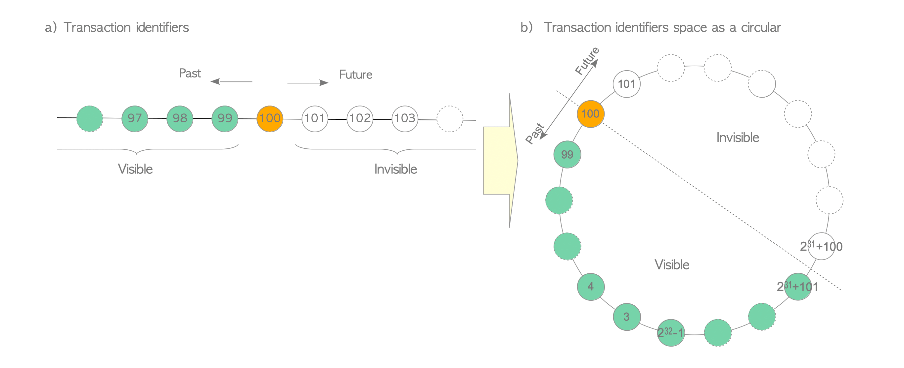

# Concurrency Control
Concurrency Control은 ACID에 해당하는 **Atomicity**, **Isolation** 을 관리하는 메커니즘  

Concurrency Control를 구현하는 방식은 크게 다음과 같다  

- Multi-version Concurrency Control (MVCC)
- Strict Two-Phase Locking (S2PL)
- Optimistic Concurrency Control (OCC)

# MVCC(Multi-version Concurrency Control)

- 각각의 쓰기(write) 연산에 대해, 이전 버전의 데이터를 유지하면서 신규 버전의 데이터를 만든다  
- 트랜잭션의 데이터 조회 시, 각 트랜잭션의 격리보장을 위해 시스템 차원에서 데이터 버전 중 하나를 선택  
- reader(데이터 조회 트랜잭션)와 writer(데이터 쓰기 트랜잭션)가 서로 블로킹(Block)하지 않는다  
    (S2PL 같은 시스템은 writer가 데이터 쓸 때, 배타 락을 얻기 위해 reader를 전부 블로킹)  
- PostgreSQL를 포함한 일부 RDBMS들은 **Snapshot Isolation(SI)** 라는 MVCC의 변형을 사용  

### Snapshot Isolation(SI)
- Oracle의 경우, 롤백 세그먼트를 통해 SI를 구현;  
    기존 버전 아이템이 롤백 세그먼트에 write 후, 신규 버전 아이템이 data area에 write  

- PostgreSQL의 경우, **visibility check rules**를 적용하는 것을 통해 SI를 구현;  
    신규 데이터는 그냥 직접적으로 관련 테이블의 페이지에 저장된다  
    데이터 아이템 조회 시, 각각 트랜잭션에 대해 적합한 버전의 아이템을 조회  

- SI는 ANSI SQL-92 표준 3가지 이상 동작 (Dirty Reads, Non-Repeatable Reads, Phantom Reads)를 허용하지 않으나, serialization 이상동작(Write Skew, Read-Only Transaction Skew)을 허용하기 때문에 진정한 의미의 Serializability를 실현하진 않는다  

- 이런 이슈를 대처하기 위해, 9.1 버전부터 Serializable Snapshot Isolation(SSI)가 추가되었다  

    **Serializable Snapshot Isolation(SSI)**  
    - serialization 이상동작을 감지
    - 이상동작으로 야기된 충돌을 해결
    - 9.1버전부터 SSI가 제공되었기 때문에, 9.1버전부터 true serializable isolation level을 제공
    - SQL Server도 SSI 사용 (Oracle은 여전히 SI만 사용)

# Transaction ID
  
- Transaction Manager가 할당하는 유니크 식별자로, 트랜잭션이 시작할때 발급  
- PostgreSQL의 txid는 32비트 unsigned integer (약 42억)  
- txid_current() 함수로 현재 txid 조회 가능  
    - 0: 유효하지 않은 txid  
    - 1: Bootstrap txid; 데이터베이스 클러스터 초기화에 사용  
    - 2: **Frozen txid**  
- 현재 할당받을 txid 기준으로 더 높은 숫자의 txid는 미래에 할당될 txid이며, 현재 txid 입장에서는 아직 invisible한 txid 들이다  
- BEGIN 커맨드에는 txid가 할당 되지 않는다; BEGIN 커맨드 실행 후 최초 커맨드가 실행 될 때 txid 할당 되고, 트랜잭션 시작함  

### Frozen txid
- **Transaction wraparound problem**(과거 트랜잭션 데이터 invisible problem)을 해결하기 위해 postgreSQL이 예약한 transaction id  
- **freeze process**에 사용됨  
- 그 어떤 txid보다 항상 과거 트랜잭션이라고 설정됨  
- 항상 inactive이며 항상 visible한 트랜잭션임을 나타냄  

**Transaction wraparound problem?**  
  
[image reference](https://www.interdb.jp/pg/pgsql05/10.html)  
(2^31 + 101 txid 입장에서 보았을때, 100 txid가 미래 txid라고 인식되어서 이미 100 txid를 통해 저장한 데이터가 invisible한 상황에 대한 예시)  

loop되는 txid 할당 구조에서, 과거 txid에서 저장한 데이터가 현재 할당된 txid 기준에서 미래 txid라고 인식되어 visible하지 않게 되는 현상  

### freeze process  
- 현재 txid 기준으로 특정 임계치(= `현재 txid` - `vacuum_freeze_min_age`)보다 오래된 txid를 frozen id(2)로 바꾸는 프로세스  
- vacuum process가 freeze process를 호출함  
- **9.4 버전 이후는 txid를 frozen_txid로 바꾸지 않고, t_infomask라는 플래그를 사용**

  
[image reference](https://www.interdb.jp/pg/pgsql05/10.html)  
