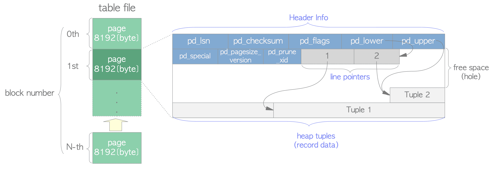

[돌아가기](https://github.com/LEEJ0NGWAN/postgreSQL-Internal)

# Database Cluster
하나의 PostgreSQL 서버가 관리하는 데이터베이스들의 모음

### PGDATA
데이터베이스 클러스터 생성 시, 데이터 저장 및 관리를 위한 Base 디렉토리가 만들어지며 PGDATA 환경변수에 Base 디렉토리 경로가 저장됨

# Database
오브젝트(SQL 오브젝트, 데이터베이스 오브젝트 등)을 관리하기 위한 최상위 계층

### PostgresqSQL 초기 디폴트 데이터베이스
- postgres  
유저, 유틸리티, 외부 툴에서 사용하는 기본 DB

- template0  
PostgreSQL에서 정의한 원시 기본 데이터베이스  

- template1  
    - 시스템 표준 데이터베이스  
    - PostgreSQL에서 `create database` 수행문으로 데이터베이스 생성 시, template1 디비를 복제하여 생성함  
    - template1은 사용자에 따른 변경 및 접속 가능

위 데이터베이스는 $PGDATA/base 디렉토리 밑에 id가 채번되어 저장되어 있다

### new database
신규 데이터베이스도 마찬가지로 `create database` 수행문으로 디비 생성 시 $PGDATA/base 디렉토리 밑에 id가 채번되어 저장된다

# Schema
오브젝트들을 포함하는 네임스페이스
- 여러 사용자가 서로 간섭 없이 하나의 데이터베이스를 사용할 수 있도록 한다
- 오브젝트들을 논리적 그룹으로 관리한다
- 스키마 분리를 통해, 오브젝트 간 이름 충돌(중복)을 방지한다

# Tablespace
오브젝트를 저장하는 파일 시스템 내 위치를 직접 지정할 수 있도록 한다;
데이터베이스 디렉토리 외부에 오브젝트 파일을 저장할 수도 있게 한다

- 파티션, 볼륨의 공간이 부족할 때, 테이블 스페이스 활용가능
- 각 오브젝트의 사용 패턴을 바탕으로 한정된 디스크 자원을 효율적으로 할당 및 성능 최적화 가능
- 테이블 스페이스 생성 시, PGDATA/pg_tblspc 디렉토리에 심볼릭 링크로 저장  
    - 심볼릭 링크는 테이블 스페이스 생성 시 지정한 위치를 가리킴
    - 테이블 스페이스에 오브젝트 생성 시 생성된 디렉토리 내부에 {database}/{object_id} 경로에 해당 오브젝트 파일 생성

# Page
PostgreSQL에서 데이터를 파일에 저장할 때 사용하는 고정크기(default: 8kb)의 영역(단위)

- 페이지의 고정크기를 변경하려면, Config 수정 후 PostgreSQL 소스 컴파일 필요 
- 페이지의 고정크기는 최대 32kb까지 변경 가능
- PostgreSQL은 파일 저장 시 필요한 파일의 크기를 페이지 단위로 확장하여 저장
- 파일의 각 페이지는 아래 요소로 구성된다  
    - Page Header  
        - 페이지의 일반적인 정보 저장
        - 페이지의 시작 부분에 위치
    - ItemIdData  
        - Item의 구분자들의 Array
        - 각 Item의 위치(offset), 크기(size) 저장
        - Page Header 다음 부분에 위치
    - Items  
        - 튜플, 데이터 레코드를 포함
        - ItemIdData의 증가(할당)를 고려하여 페이지의 마지막부터 역방향으로 증가(할당)  
            - ItemIdData: 1, 2, 3, ... (정방향)
            - Item: ... , Tuple3, Tuple2, Tuple1 (역방향)
        - Item 구조는 테이블 내용에 따라 상이
    - Free Space  
        - ItemIdData와 Item 사이에 존재하는, 아직 할당되지 않은 영역
    - Special Space
        - Access Method에서 필요한 추가 정보를 저장하는 영역
        - Access Method에 따라 각기 다른 데이터를 저장

# Page Layout
테이블, 인덱스 파일에서 사용하는 공통적인 구조  
테이블, 인덱스(B-Tree ...) 등 타입이나 데이터 접근 방식(Access Method)에 따라 페이지 레이아웃의 내용이 다르게 채워진다

  
[image reference](https://en.wikibooks.org/wiki/PostgreSQL/Page_Layout)

## Table File Layout

  
[image reference](https://m-abdullahi.com/postgresql-internal-part-1/)

테이블 파일 레이아웃의 경우, special space를 활용하지 않음

### 쓰기

테이블 파일에 새로운 데이터를 쓰기 전에, 현재 페이지의 공간을 체크한다  
새롭게 저장될 튜플의 크기와 Free Space (= pd_lower - pd_upper)를 비교하여, 해당 페이지에 튜플을 저장할 지 결정한다

### 읽기

  
[image reference](https://muatik.medium.com/notes-on-postgresql-internals-4050340c9f4f)

- Sequential scan: 테이블 파일만 활용하여 순차적으로 튜플 스캔
- Index scan: 인덱스 파일에서 대상이 되는 데이터의 인덱스 튜플 추출 및 테이블 파일의 튜플을 바로 스캔

