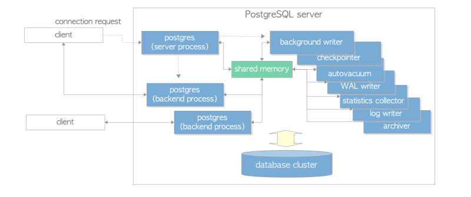
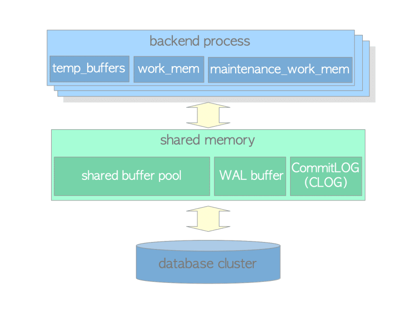
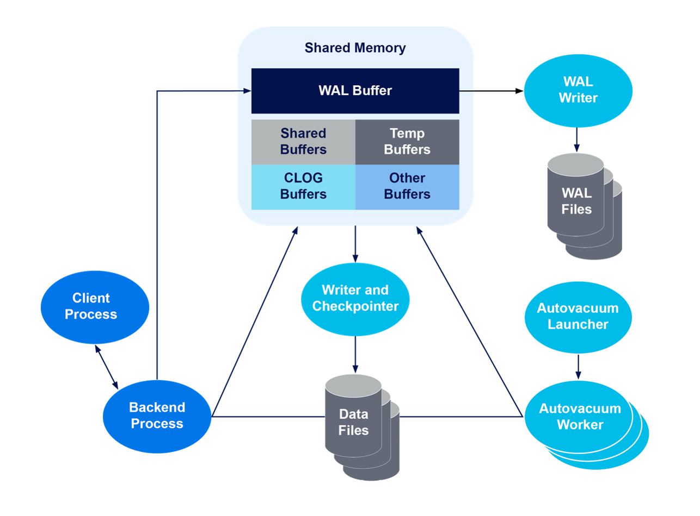

[돌아가기](https://github.com/LEEJ0NGWAN/postgreSQLTutorial)

# Client-Server 모델
PostgreSQL은 클라이언트-서버 모델을 사용  
- 클라이언트: 웹서비스 백엔드 애플리케이션과 같이 커넥션을 요구하여 DB를 사용하는 외부 프로그램을 총칭
- 서버: 하나의 데이터베이스 클러스터를 운영하는 프로세스 집합이 되는 PostgreSQL 서버

# Process

  
[image reference](https://dev.to/fatemasamir/exploring-the-process-and-memory-architecture-of-postgresql-chapter-2-1997)

- postgres
- postgres: checkpointer
- postgres: background writer
- postgres: walwriter
- postgres: autovacuum launcher
- postgres: stats collector
- postgres: logical replication launcher

### postgres
PostgreSQL 서버 시작 시, 최초로 생성되는 데이터베이스 서버 프로세스  

- 백엔드 프로세스, 백그라운드 프로세스를 생성
- 클라이언트로부터 커넥션 요청을 받으면, 백엔드 프로세스를 생성하여 커넥션 할당
- 데이터베이스 클러스터 하나 당 한개의 postgres 프로세스 생성됨

### 백엔드 프로세스
자신에게 배정된 커넥션을 통해 요청된 쿼리 및 명령을 수행하는 워커 프로세스  

- 커넥션과 1:1 매핑 됨; 커넥션 맺어질 때마다 postgres 프로세스에 의해 생성(fork)
- 커넥션 연결된 클라이언트와 TCP/IP 기반 통신 수행
- PostgreSQL의 max_connections 파라메터로 최대 커넥션 개수 조절 가능 (Default: 100)

### Connection Pool
- PostgreSQL은 내부적으로 Connection Pooling을 사용하지 않음  
- 커넥션을 맺고 끊는 과정은 성능 저하를 유발시킴
- pgbouncer, pgpool-II 와 같은 extension을 통해 내부적으로 커넥션 풀링 설정 가능

### 백그라운드 프로세스
백엔드 프로세스를 제외하고, 다양한 부가작업을 처리하기 위해 백그라운드로 동작하는 프로세스

- Background Writer  
    공유 버퍼에 저장된 Dirty Page(변경되었지만 반영이 되지 않은 Page)를 디스크에 기록

- Checkpointer  

- Auto-vacuum Launcher  
    Auto-vacuum 수행을 위해, postgres로 auto-vacuum워커 프로세스 생성 요청

    **Auto-vacuum?**  
    PostgreSQL에서만 사용되는 특별한 동작으로,  
    GC(Garbage Collector)와 같은 역할을 DB내부에서 자동으로 수행한다  

    - **임계치 이상 발생한 Dead Tuple 정리하여 FSM(Free Space Map)으로 반환**
    - **Transaction ID Wraparound 방지**
    - 통계정보 갱신
    - visibility map 갱신 및 index scan 향상

- WAL Writer  
    아직 디스크에 기록되지 않은 WAL Buffer 트랜잭션 레코드를 디스크에 기록

    **WAL(Write-Ahead Logging)**  
    트랜잭션 수행 전 미리 기록하여 undo,redo를 수행할 수 있게 하는 로깅

- Statistics Collector  
    PostgreSQL의 세션, 테이블 등의 통계(pg_stat_activity, pg_stat_all_tables)를 수집 후 pg_catalog에 업데이트

- Logger  
    모든 프로세스에서 발생한 오류 메세지를 pg_log 디렉토리 내부 로그 파일로 기록

- Archiver  
    아카이빙 수행; WAL 세그먼트가 전환될 때, WAL파일을 아카이빙 영역으로 복사

# Memory

  
[image reference](https://dev.to/fatemasamir/exploring-the-process-and-memory-architecture-of-postgresql-chapter-2-1997)

- 로컬 메모리: 백엔드 프로세스들이 용도에 따라 독자적으로 가지는 메모리 영역  
    - Work memory  
        Executor에서 Sort와 Hash 수행 시, Temp 파일을 사용전 접근하는 메모리  
        - work_mem 동적 파라메터로 조정 가능 (default: 4MB)  
        - Sort: ORDER BY, DISTICT, MERGE JOIN, ...
        - Hash: HASH JOIN, HASH AGGREGATION, IN SUBQUERY, ...
    - Maintenance work memory  
        유지 관리 작업(vacuum, 인덱스 생성, 테이블 변경, 외래키 추가)에 사용하는 메모리  
        - maintenance_work_mem 동적 파라메터로 조정 가능 (default: 64MB)
    - Temp buffers Memory  
        Temporary 테이블에 사용 시, 임시로 할당되는 공간  
        - temp_buffers 동적 파라메터로 조정 가능 (default: 8MB)
    - Catalog Cache  
        System Catalog 메타데이터 이용 시 사용하는 메모리  
        - 세션에서 조회 하는 빈도가 높음
        - 디스크에서 읽을 경우 성능 저하가 발생할 수 있기 때문에 로컬 메모리로 사용
    - Optimizer & Executor  
        Planner와 Executor에서 쿼리 수행 최적 플랜 계산할 때 사용하는 메모리  

  
[image reference](https://www.instaclustr.com/blog/postgresql-architecture/)

- 공유 메모리(Shared Memory Area): 데이터베이스 클러스터 하나 당 전 영역에 공유하는 메모리 영역  
    - Commit Log (CLOG) Buffer: 각 트랜잭션 상태 정보 캐싱하는 공간
    - WAL Buffer  
        - 각 세션에서 수행하는 트랜잭션의 변경 로그 캐싱
        - Recovery 수행 시 데이터를 재구성할 수 있도록 함
        - wal_buffers 정적 파라메터로 조정 가능 (정적이므로 변경 시 재기동 필수)
    - Shared Buffer Pool  
        - 데이터와 데이터 변경사항을 page 단위로 캐싱하여 I/O를 빠르게 처리하기 위한 영역
        - shared_buffers 정적 파라메터로 조정 가능 (default: 128MB)