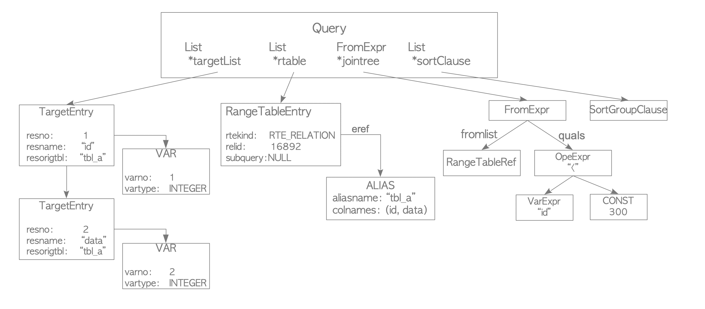

[돌아가기](https://github.com/LEEJ0NGWAN/postgreSQL-Internal)

# Query Processing
백엔드 프로세스가 자신이 담당하는 커넥션으로부터 들어온 쿼리를 처리하는 과정

[image reference](https://www.interdb.jp/pg/pgsql03/01.html)

### Parser
입력받은 쿼리의 문법(Syntax)을 검증 및 문법 구조를 바탕으로 Parse Tree 생성하는 과정  

- **문법검증**은 SELECT, FROM, WHERE 등의 구문 위치 체크나 쉼표 등의 문자열 체크  
- 실제 테이블이나 칼럼 존재 여부 같은 **Semantic 검증은 하지 않는다**(Semantic 검증은 Analyzer에서 수행)  

**Parse Tree**  
`Parse Node`라는 구조체로 이루어진 Tree;  
`Parse Node`는 해당 구문의 성격(INSERT, SELECT 등)에 따라 내용이 다르다

[image reference](https://levelup.gitconnected.com/query-processor-in-postgresql-c1c23cca20cf)

### Analyzer
**Parser** 에서 생성한 Parse Tree를 바탕으로 Query Tree를 생성하는 과정  

- Parse Tree 내부 테이블, 칼럼, 연산자의 유효성에 대해 **Semantic 검증(System Catalog 조회)** 수행  
- 해당 Semantic 검증 내용을 바탕으로 Query Tree를 생성  
- Query Tree는 테이블과 칼럼 참조를 위한 정보를 추가로 포함  

**Query Tree**

**Query**라는 루트 노드를 가지는, Parse Tree를 바탕으로 가공된 Tree  

- **Query**는 Parse Tree의 구조체들과 같은 곳에 구현되어 있음  

- Query Tree는 relid(Relation id)와 같이 실제 대상 오브젝트 참조를 위한 id 정보가 주가됨

[image reference](https://www.interdb.jp/pg/pgsql03/01.html)

### Rewriter  
가공된 query tree를 사용자가 **Rule System**에 저장한 규칙 기반으로 재구성하는 과정  

**Rule System**  
테이블의 작업문(INSERT, UPDATE, DELETE)에 대해, 사용자가 지정한 작업을 대신 수행할 수 있는 기능  

### Planner(Optimizer)  
쿼리가 요구하는 데이터의 명세(Query Tree)를 기반으로 해당 데이터를 조회 및 가공하기 위한 **Plan Tree(실행 계획)** 을 생성하는 과정  

- 한 쿼리에 대해 수 많은 조합의 계획(Plan Tree)이 생성될 수 있고,  
    각 계획의 비용(cost)을 계산하여 가장 효율적인 계획을 채용  

- PostgreSQL은 Cost-based optimization 방식을 사용  
    **(Oracle방식과 다름)**

### Executor
Planner로부터 받은 Plan Tree의 Plan을 반복적으로 처리 후 필요한 Row 받아오는 과정  
