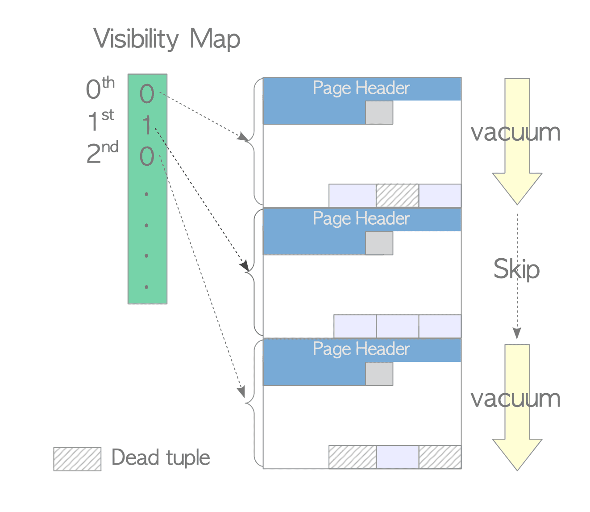
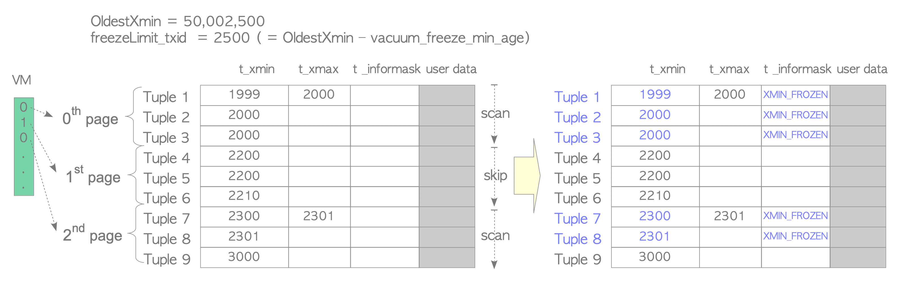
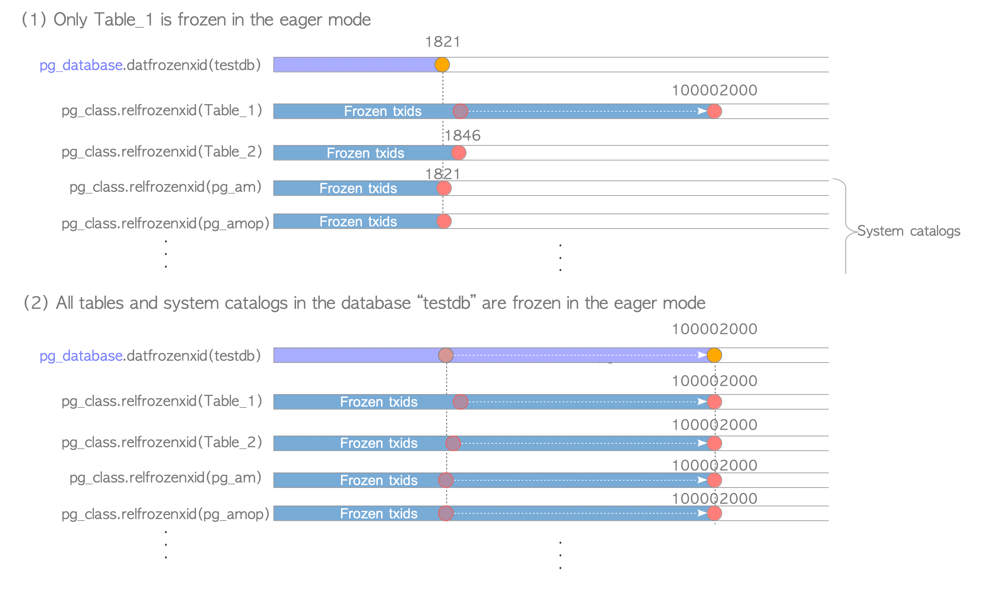
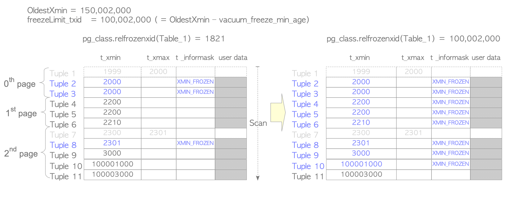
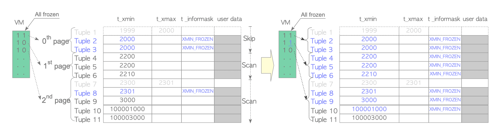
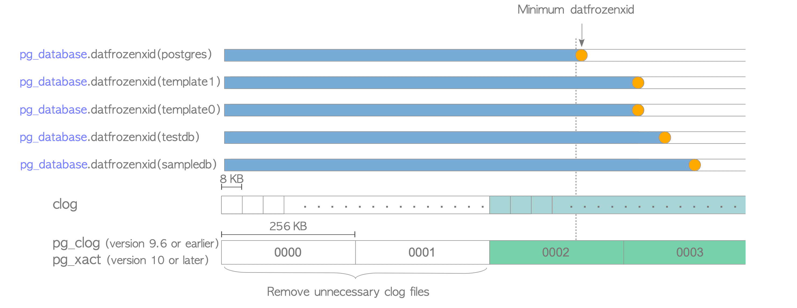
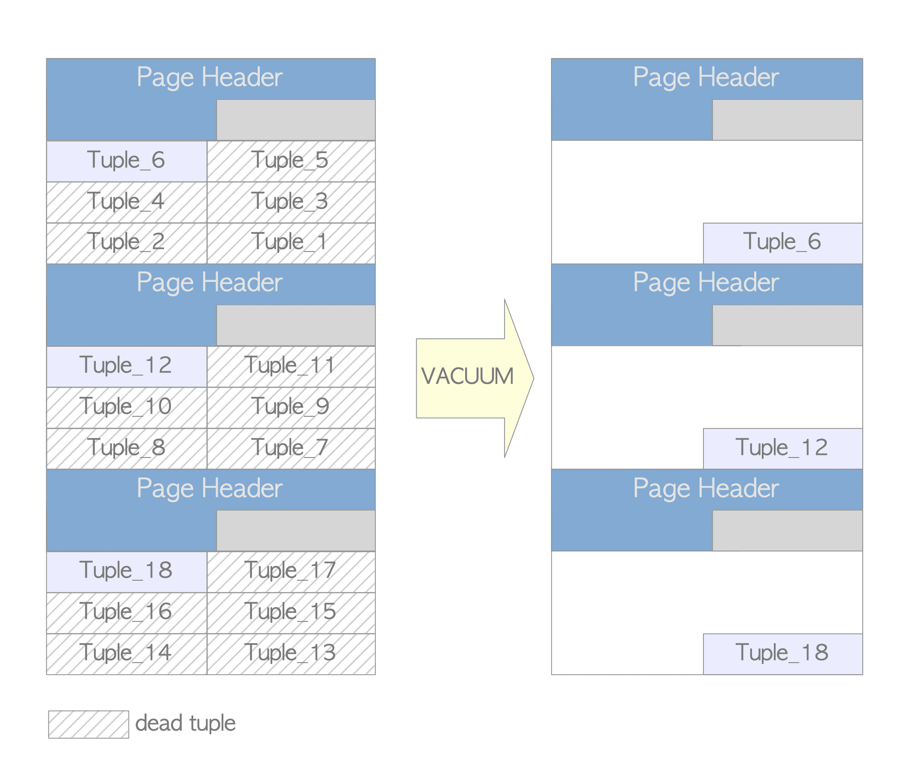
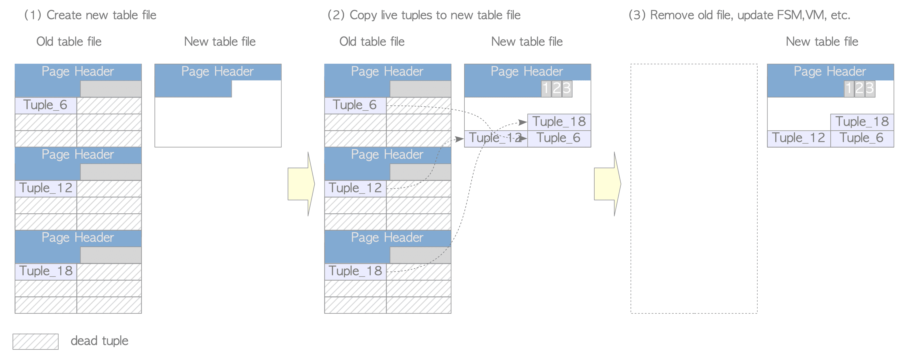

[돌아가기](https://github.com/LEEJ0NGWAN/postgreSQL-Internal)

# Vacuum Processing
- PostgreSQL의 지속적 운영을 위한 유지보수 프로세스
- dead tuples 제거
- txid freeze 화
- Vacuum processing은 **concurrent vacuum**, **full vacuum** 모드가 있다
- vacuum processing은 전체 테이블을 스캔하는 작업이 있어 비용이 비싼 프로세스
- PostgreSQL 8.4버전부터 dead tuple 제거 성능 향상을 위해 Visibility Map(VM)이 도입됨
- PostgreSQL 9.6버전부터 VM 향상을 통해 freeze process 성능 향상
- ring buffer를 사용하기 때문에, vacuum 수행된 페이지들은 shared buffer에 캐싱되지 않는다

# Concurrent Vacuum
Concurrent Vacuum은 데이터베이스 내부 전체 테이블 또는 특정 테이블들에 대해 다음과 같은 프로세스를 수행한다  

1. Dead tuple 제거  
    - 각 페이지의 dead tuple를 제거하고, 단편화 되어 있는 live tuple들의 위치를 정리한다  
    - dead tuple을 가리키는 index tuple 또한 제거  

2. old txid freeze 화  
    - 필요 시, 튜플의 old txid를 freeze id로 변경  
    - 시스템 카탈로그(pg_database, pg_class) 관련 frozen txid를 업데이트  
    - 가능하다면, clog의 불필요한 부분을 제거  

3. 그 외  
    - Vacuum 진행한 테이블의 FSM(Free Space Map; 데이터 블록의 빈 공간 정보를 기록), VM 업데이트  
    - 통계 업데이트 (pg_stat_all_tables, ...)  

### Concurrent Vacuum 동작 순서
각 Vacuum 대상 테이블을 순회하며 크게 3가지 동작을 진행하고, 마지막으로 후처리 작업을 진행한다  

> **각 테이블 순회 작업 진행**  
>> **사전 동작**  
>> `ShareUpdateExclusiveLock lock 획득`  
    (다른 트랜잭션들 테이블 조회 가능)  
>>  
>> **1번째 동작**  
>>>    모든 페이지의 모든 dead tuple 스캔  
    필요 시 old tuple freeze 진행  
    dead tuple을 가리키는 index tuple 제거
>>  
>> - PostgreSQL이 dead tuple과 old tuple을 추리기 위해 테이블을 스캔  
>> - `maintenance_work_mem` 이라는 로컬메모리에 저장  
>> - 추려낸 dead tuple 리스트를 참조하여 index 튜플 제거
>>      - clean stage 라고 부름
>>      - cost가 비쌈
>>      - 11 버전에서 성능개선 이루어짐
>>      - 10 이하 버전에서는 항상 cleanup stage가 실행되었지만, 11버전부터는 인덱스가 B-tree 일때, cleanup stage 실행 여부를 `vacuum_cleanup_index_scale_factor`라는 config 파라매터에 의해 결정  
>> - `maintenance_work_mem` 사이즈가 full이고 스캔이 완료되지 않을 시, 일단 현재 진행사항을 미루고 다음 단계를 진행한다 (추후 멈췄던 단계로 돌아와 다시 작업 진행)
>>  
>> **2번째 동작**  
>> 각 페이지 순회 작업 진행  
>>>    dead tuple 제거  
    live tuple 위치 재할당 후 FSM,VM 업데이트  
>> - 페이지 별로 차례대로 진행  
>> - dead tuple 지운 후 live tuple의 데이터 위치 정리(defragmentation)  
>> - **dead tuple을 가리키던 line pointer는 제거 되지 않는다**  
>>      - 제거 되지 않고 재활용된다  
>>      - 제거되면 관련된 모든 인덱스 튜플이 전부 업데이트 되어야 하기 때문  
>>  
>> **3번째 동작**
>>>    index 정리  
    마지막 페이지에 live tuple이 없다면 마지막 페이지 truncate 진행  
    테이블의 시스템 카탈로그와 통계 업데이트  
>> 
>> **사후 동작**  
>> `ShareUpdateExclusiveLock lock 릴리즈`  
>> 
> **후처리**  
>>    시스템 카탈로그 및 통계 업데이트  
    clog 내부 불필요한 페이지와 파일을 제거  


**Concurrent Vacuum 수도 코드**  
[reference](https://www.interdb.jp/pg/pgsql06/01.html)
```
(1)    FOR each table
(2)      Acquire a ShareUpdateExclusiveLock lock for the target table

         /* The first block */
(3)      Scan all pages to get all dead tuples, and freeze old tuples if necessary 
(4)      Remove the index tuples that point to the respective dead tuples if exists

         /* The second block */
(5)      FOR each page of the table
(6)         Remove the dead tuples, and Reallocate the live tuples in the page
(7)         Update FSM and VM
         END FOR

         /* The third block */
(8)      Clean up indexes
(9)      Truncate the last page if possible
(10)     Update both the statistics and system catalogs of the target table
            Release the ShareUpdateExclusiveLock lock
      END FOR

      /* Post-processing */
(11)  Update statistics and system catalogs
(12)  Remove both unnecessary files and pages of the clog if possible
```

**PARALLEL Option**  
- PostgreSQL 13부터 Concurrent Vacuum 명령에 PARALLEL 옵션을 지원  
- 해당 옵션은 index에 대해 병렬로 vacuuming 및 cleaning 진행하도록 함  
- autovacuum은 지원하지 않는 옵션  

# Visibility Map
- cost가 비싼 vacuum processing 의 비용 절감을 위해 8.4버전부터 도입
- 각 테이블 파일 내부 페이지들의 visibility를 보관
    - 각 페이지 visiblity는 페이지 별로 dead tuple 여부 결정
    - visibility를 통해 dead tuple이 없다고 판단이 되면 해당 페이지는 skip
- 1개 이상의 8kb 페이지들로 각 (테이블) VM을 구성
- vm 파일은 `_vm` 라는 suffix가 이름에 붙음
- 9.6 버전부터 페이지 별 튜플의 frozen 여부에 대한 정보 추가

  
[image reference](https://www.interdb.jp/pg/pgsql06/02.html)  
(VM을 통한 dead tuple 여부 체크 및 페이지 skip 예시)  

# Freeze Processing
- old tuple의 txid를 freeze txid로 대체하는 작업
- **lazy mode**와 **eager mode**가 존재
    - lazy mode
        - 테이블의 VM을 참조하여 dead tuple이 있는 페이지만 freeze 작업 진행
    - eager mode
        - 모든 페이지 순회하여 freeze 작업 스캔 수행
        - freeze 작업 관련 시스템 카탈로그 업데이트
        - clog 내부 불필요한 부분 제거
- 보통 **lazy mode**로 동작하지만, 특정 상황에 따라 **eager mode**가 동작함

### Lazy Mode
- freeze 작업 수행 시, PostgreSQL은 **freezeLimit_txid**를 계산
- **freezeLimit_txid**
    - **freezeLimit_txid** 보다 낮은 t_xmin 값의 튜플을 freeze 수행
    - **freezeLimit_txid** = OldestXmin - vacuum_freeze_min_age
        - OldestXmin: 현재 수행중인 트랜잭션 중 가장 오래된 txid
        - vacuum_freeze_min_age: config 파라매터 (default: 50000000)
        - 현재 수행중인 트랜잭션이 없다면, Vacuum을 실행하는 트랜잭션의 txid가 OldestXmin으로 사용됨

  
[image reference](https://www.interdb.jp/pg/pgsql06/03.html)  
(다른 진행중인 트랜잭션은 없고, txid = 50002500인 트랜잭션이 Vacuum을 수행하는 예시)

### Eager Mode
- lazy mode에서 skip 되는 페이지들을 포함하여 전체 freeze 수행
- **pg_database.datfrozenxid** < OldestXmin - vacuum_freeze_table_age 만족 시 eager mode 발동
    - **pg_database.datfrozenxid**
        - 시스템 카탈로그 **pg_database**에 저장하는 로우 칼럼
        - 각 데이터베이스의 **oldest frozen txid**를 저장
        - 9.5버전 기준 데이터베이스 클러스터 신규 설치 시 초기 값은 1821
        - vacuum 작업 종료 전, 필요 시 **pg_database.datfrozenxid** 값 업데이트
        - 데이터베이스 내 모든 테이블(시스템 카탈로그 테이블 포함)이 frozen 되었을 때, **pg_class.relfrozenxid** 의 최솟값을 저장  

          
        [image reference](https://www.interdb.jp/pg/pgsql06/03.html)  
        (relfrozenxid가 업데이트 되었을 때 해당 데이터베이스의 datfrozenxid 변화 예시)

    - vacuum_freeze_table_age
        - config 파라매터 (default: 150000000)
- 테이블 freeze 후, 각 테이블의 **pg_class.relfrozenxid** 값 업데이트 함  
    - **pg_class.relfrozenxid**
        - 시스템 카탈로그 **pg_class**에 저장하는 로우 칼럼
        - 해당 테이블의 **latest frozen xid**를 나타냄
        - (OldestXmin - vacuum_freeze_min_age) 를 통해 구해진 **freezeLimit_txid**를 **pg_class.relfrozenxid**로 사용

  
[image reference](https://www.interdb.jp/pg/pgsql06/03.html)  
(다른 진행중인 트랜잭션은 없고, txid = 150002000인 트랜잭션이 Vacuum을 수행하는 예시)

**FREEZE option**  
- 쿼리로 VACUUM 명령 수행 시 FREEZE 옵션을 사용하면, frozen을 수행해야하는 테이블들의 모든 txid를 강제 freeze  
- 해당 옵션은 eager mode 에서만 동작
- **freezeLimit은 OldestXmin으로 설정됨 ( OldestXmin - vacuum_freeze_min_age 가 아니다!)**  

### Improving Freeze Processing in Eager Mode
- 9.6버전 이전은 모든 페이지를 전부 스캔해야하기 때문에 성능 문제가 있음
- 9.6버전부터 VM 및 freeze process(eager mode) 성능 향상
- VM에 각 페이지별 모든 튜플의 frozen 여부 추가
- eager mode 수행 시, 해당 모든 튜플 frozen 여부를 통해 페이지 스킵 진행

  
[image reference](https://www.interdb.jp/pg/pgsql06/03.html)  

# Removing Unnecessary Clog Files
**pg_database.datfrozenxid**가 업데이트((eager mode)) 될 때 마다, 필요 없는 clog(트랜잭션 상태 저장) 파일(최대 256kb, 0000부터 시작) 및 페이지(각 8kb in 파일) 제거

  
[image reference](https://www.interdb.jp/pg/pgsql06/04.html)  
(최소 datfrozenxid 값이 저장된 0002 파일 미만의 0000, 0001 파일이 제거되는 예시)

# AutoVacuum Daemon
- Vacuum process를 자동화 하여 PostgreSQL 운영을 원활하게 보조하는 데몬
- 주기적으로 여럿 autovacuum_worker 프로세스를 호출
- 디폴트 설정
    - 1분마다 수행 (defined by autovacuum_naptime)
    - 3개의 worker 프로세스 호출 (defined by autovacuum_max_works)
- 워커들은 동시다발적으로 vacuum 수행하며, 최대한 데이터베이스에 영향이 덜 가도록 수행  

### autovacuum conditions
다음 조건 중 하나라도 만족하는 테이블이 있다면 autovacuum을 수행한다
1. current_txid < relfrozenxid + autovacuum_freeze_max_age
    - relfrozenxid: pg_class 카탈로그에 저장된 해당 테이블 값
    - autovacuum_freeze_max_age: config 파라매터(default: 200000000)
2. dead tuple 개수 > autovacuum_vacuum_threshold + autovacuum_vacuum_scale_factor x reltuples
    - autovacuum_vacuum_threshold: config 파라매터 (default: 50)
    - autovacuum_vacuum_scale_factor: config 파라매터 (default: 0.2)
    - reltuples: 해당 테이블의 튜플 개수
3. 테이블에 삽입된 tuple 개수 > autovacuum_vacuum_insert_threshold + autovacuum_vacuum_insert_scale_factor x reltuples
    - autovacuum_vacuum_insert_threshold: config 파라매터 (default: 1000)
    - autovacuum_vacuum_insert_scale_factor: config 파라매터 (default: 0.2)
    - reltuples: 해당 테이블의 튜플 개수
    - **이 조건은 PostgreSQL 버전 13부터 추가**
4. mod_since_analyze > autovacuum_analyze_threshold + autovacuum_analyze_scale_factor x reltuples
    - **analyze process 추가로 수행**
    - mod_since_analyze: 직전 analyze process 시점부터 수정된 튜플의 수
    - autovacuum_vacuum_analyze_threshold: config 파라매터 (default: 50)
    - autovacuum_vacuum_analyze_scale_factor: config 파라매터 (default: 0.1)
    - reltuples: 해당 테이블의 튜플 개수

# Full Vacuum

- Concurrent Vacuum 수행해도, 테이블 크기는 경감되지 않고 디스크 공간이 낭비되는 문제를 극복  
      
    [image reference](https://www.interdb.jp/pg/pgsql06/06.html)  
    (concurrent vacuum 후 잉여 페이지 공간에 대한 극단적인 예시)

- Full Vacuum 수행 시, 그 어떤 read/write 트랜잭션도 해당 테이블에 접근할 수 없다

### Full Vacuum mode outline

  
[image reference](https://www.interdb.jp/pg/pgsql06/06.html)  
(full vacuum 예시)

- 해당 테이블에 대해 **AccessExclusiveLock** lock 획득 후, 8kb짜리 신규 테이블 파일을 생성  
    **AccessExclusiveLock**  
    - 다른 유저가 테이블에 접근하는것을 방지  
- live tuple 전부 신규 테이블 파일로 복사  
- 오래된 테이블 제거
- index 재구성
- 관련 카탈로그, 통계, FSM, VM 업데이트

### Full Vacuum Pseudocode
```
(1)  FOR each table
(2)     Acquire AccessExclusiveLock lock for the table
(3)     Create a new table file
(4)     FOR each live tuple in the old table
(5)        Copy the live tuple to the new table file
(6)        Freeze the tuple IF necessary
        END FOR
(7)     Remove the old table file
(8)     Rebuild all indexes
(9)     Update FSM and VM
(10)    Update statistics
        Release AccessExclusiveLock lock
     END FOR
(11) Remove unnecessary clog files and pages if possible
```
[reference](https://www.interdb.jp/pg/pgsql06/06.html)

